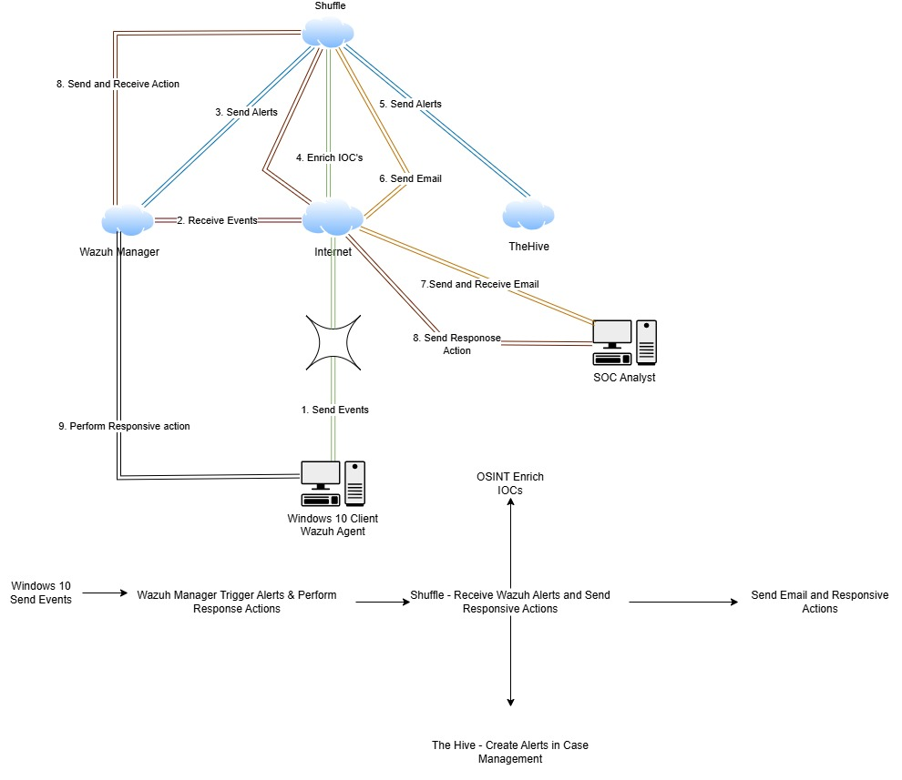

# Module 01: Logical Architecture & Data Flow

## 1. Overview
Design of an end-to-end automated SOC pipeline integrating endpoint detection, SIEM analysis, SOAR orchestration, OSINT threat intelligence enrichment, case management, and automated containment.

---

## 2. Architecture Diagram

  
🔍 Click to view image

  
   
  

## 3. Data Flow Pipeline

1. **Endpoint Telemetry:** Windows 10 generates process and network activity logs (Sysmon + Wazuh Agent).
2. **SIEM Ingestion & Detection:** Wazuh Manager receives telemetry, correlates events, and triggers alerts on suspicious activity.
3. **SOAR Webhook:** Wazuh forwards alert payloads to Shuffle SOAR via REST API.
4. **OSINT Enrichment:** Shuffle parses IOCs (hashes, IPs) and queries VirusTotal API for threat reputation scores.
5. **Case Management:** Shuffle automatically creates a case in TheHive with enriched observables.
6. **Analyst Notification:** Shuffle sends an email alert containing alert context and containment action prompts.
7. **Analyst Decision:** SOC analyst reviews the alert and approves/denies containment via the interactive prompt.
8. **Response Execution:** Shuffle triggers the Wazuh Active Response API upon receiving approval.
9. **Active Containment:** Wazuh Agent isolates the Windows 10 host from the network.

---

## 4. Technology Stack & Ports

| Component | Role | Interface / Port |
| :--- | :--- | :--- |
| **Windows 10** | Target endpoint with Sysmon & Wazuh Agent | Agent communication |
| **Wazuh Manager** | Central SIEM / XDR detection engine | TCP 1514 / 1515, REST API (55000) |
| **Shuffle SOAR** | Workflow automation, enrichment, & orchestration | HTTPS Webhooks |
| **TheHive** | Security incident response & case management | REST API (TCP 9000) |
| **VirusTotal** | External OSINT threat intelligence | Public REST API |
