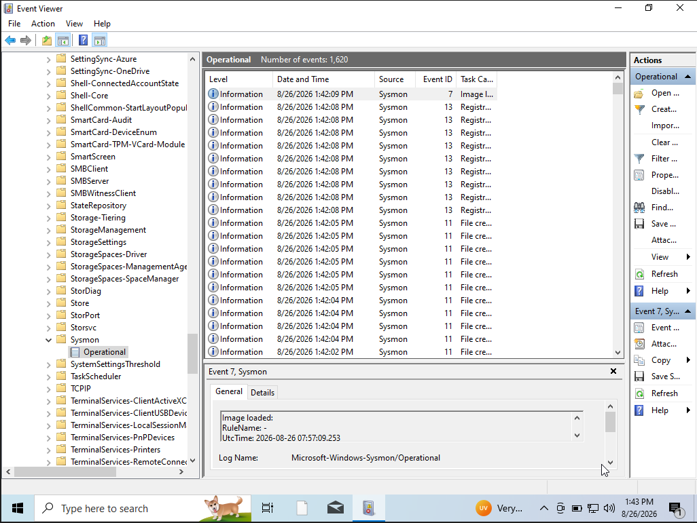

 # Module 02: Infrastructure Provisioning & Core Deployment

## 1. Environment Matrix
* **Windows 10 Client:** Local VM running Sysmon to capture endpoint telemetry.
* **Wazuh Server:** Ubuntu 22.04 on DigitalOcean running Wazuh Manager, Indexer, and Dashboard.
* **TheHive Server:** Ubuntu 22.04 on DigitalOcean running TheHive 5, Cassandra, and Elasticsearch.

---

## 2. Windows 10 & Sysmon Setup
Installed Sysmon with the SwiftOnSecurity configuration to monitor process creation and network events.

<details>
  <summary>View Sysmon Setup</summary>
  <br>
  
  
  
</details>

---

## 3. Cloud Firewall Rules
Restricted DigitalOcean inbound traffic to my public IP on ports 22 (SSH), 443 (Wazuh Dashboard), and 9000 (TheHive UI).

<details>
  <summary>View Cloud Firewall</summary>
  <br>
  <!--  -->
</details>

---

## 4. Wazuh SIEM Installation
Deployed Wazuh All-in-One via the quickstart script:

```bash
curl -sO [https://packages.wazuh.com/4.8/wazuh-install.sh](https://packages.wazuh.com/4.8/wazuh-install.sh) && sudo bash ./wazuh-install.sh -a
